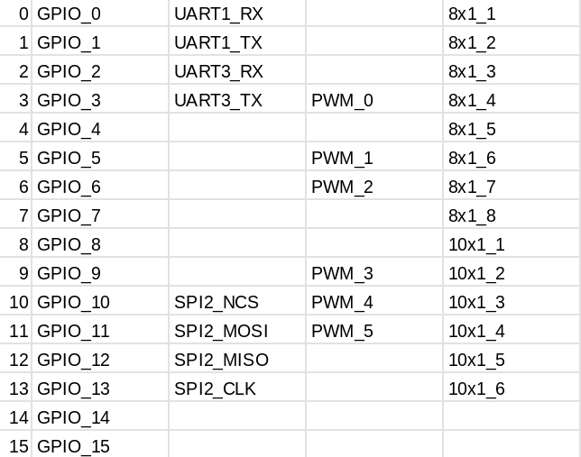
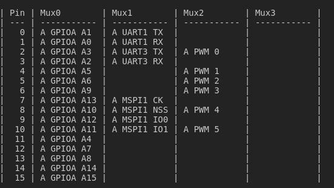

* Existing pinmux.bsv for testing purpose:
```
cd src/test_bsv
make
```

* Pinmux generator help:
```
python src/pinmux_generator.py -h
```

* To create a microtest directory and bsv files:
```
python src/pinmux_generator.py -v -o microtest -s microtest
python src/pinmux_generator.py -v -o microtest
```

* To create a minitest directory and bsv files:
```
python src/pinmux_generator.py -v -o minitest -s minitest
python src/pinmux_generator.py -v -o minitest
```

* Existing specifications in 'src/spec/' : m_class, i_class, c_class, microtest, minitest

* Testing pinmux using cocotb:
```
cd src/test_bsv/tests
```
---

### Steps to generate **custom pinmux.bsv** :
1 . Let's say that the pinmap which we wish to implement is :
 

The default order for UART and SPI with pinmux repository is :
```
	* UART : tx -> rx
```
```
	* MSPI: ck -> nss -> io0 -> io1
```
After generating minitest, this order can be observed in uart.txt, mspi.txt, etc. 

2 . We will rearrange the order of pins of our pinmap to confine to default  order : 
After reordering, it will look like: 


3. How to specify this table to generate pinmux.bsv? 
In pinmux repository, we write the specifications in 'src/spec' directory, like default minitest.py.
For this case, we will simply modify original minitest.py to suit our table. 
	* We have only one bank here with 16 rows. So : 'A' : (16,4) in pinbanks. 
	* In function names, keep only the one which are present in table and update the id as per table. 
	* Specifying entry in the table: 
	1) ps.gpio("" ,  ('A', 12) , 0 , 7 , 2 ) 
	There are 5 arguments passed. 2nd argument specifies bank and pin number.  3rd entry specifies the mux select line (which column?). 4th entry specifies the GPIO id. 5th entry specifies the collection of entries. Here, this will reflect to (GPIOA A7) at pin number 12, and  (GPIOA A8) at pin number 13.
	
	2) ps.mspi("2", ('A', 7), 1)
	 There are 4 arguments passed. 1st argument specifies the id of MSPI. 2nd argument specifies the bank and pin number. 3rd argument specifies the mux selection line. Here this will reflect as: 
	 pin number 		mux1
	 7				A MSPI2 CK
	 8				A MSPI2 NSS
	 9				A MSPI2 IO0
	 10				A MSPI2 IO1
	 
	 3) ps.uart(" 3 ", ( 'A', 2 ) , 1 )
	 Here, argument meaning is same as (2)
	 
	 4) ps.pwm("" , ('A', 10) ,  2 ,  5 , 1 )
	 Here, argument meaning is same as (1)

	 
The complete python file for this table is : src/spec/minitest.py .
Original minitest: src/spec/minitest_old.py


# Viewing pinout image

    pqiv --watch-files=on --background-pattern=white ls180/ls180.svg
